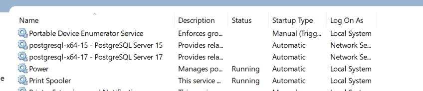

+++
title = 'Upgrade from PostgreSQL 15 to 17 on Windows using pg_upgrade'
date = 2024-11-10T14:26:17-06:00
draft = false
author = 'Christopher Tyler'
tags = ['pg_upgrade','postgresql','windows 10','pg_dump','pg_dumpall']
+++

## Overview

At work I needed to upgrade from PostgreSQL from 15 to 17.
The process is not that different than upgrading in Ubuntu but there were a couple
of items that threw me off.

## Perform Backup

This should be done prior to the update in case something goes wrong:

```powershell
CTyler@CTYLER_NB  C:\Program Files\PostgreSQL\17\bin  [08:22]  
❯ & 'C:\Program Files\PostgreSQL\17\bin\pg_dumpall.exe' -p 5432 -U postgres -f D:\Backups\postgresql-ctyler_nb-20241107-1.out
```

This was based on the documentation
[PostgreSQL: Documentation: 17: pg_dumpall](https://www.postgresql.org/docs/current/app-pg-dumpall.html).

**Note** keep in mind that you should create a `pgpass.conf`
(or `.pgpass` for Linux):

```text
# server:port:database:user_name:password
*:5432:*:postgres:YOUR_PASSWORD
```

This file is located `C:\Users\ctyler\AppData\Roaming\postgresql`
(or `chmod 0600 ~/.pgpass` with the right permissions).
[PostgreSQL: Documentation: The Password File](https://www.postgresql.org/docs/current/libpq-pgpass.html).

## Remove admipack extension

This extension will need to be removed as it have been deprecated:

```sql
christopher@CTYLERNB:~$ psql -U postgres  
postgres@ctyler_nb:postgres> DROP EXTENSION adminpack CASCADE;  
You're about to run a destructive command.  
Do you want to proceed? (y/n): y  
Your call!  
DROP EXTENSION  
Time: 0.009s  
postgres@ctyler_nb:postgres> \q  
Goodbye!
```

## Stop Both Servers

Go to `Start->Search->Serivces` and stop both services:


## Update pg_hba.conf

Make the following changes:

```text
# IPv4 local connections:
# host    all             all             127.0.0.1/32            scram-sha-256
host    all             all             127.0.0.1/32            trust
# IPv6 local connections:
# host    all             all             ::1/128                 scram-sha-256
host    all             all             ::1/128                 trust
```

This remove the permissions so that you don't error during upgrade.
This need to be done on both clusters.

## Run pg_upgrade

Now let's perform the upgrade.
Open PowerShell as Adminstrator.

```powershell
❯ cd "C:\Program Files\PostgreSQL\17\bin"
❯  .\pg_upgrade.exe --old-datadir "C:/Program Files/PostgreSQL/15/data" --new-datadir "C:/Program Files/PostgreSQL/17/data" --old-bindir "C:/Program Files/PostgreSQL/15/bin" --new-bindir "C:/Program Files/PostgreSQL/17/bin" --old-port=5432 --new-port=5433 -U postgres
```

I had to add ports and `postgres` user.
I got this info from
[Upgrading PostgreSQL in Windows · GitHub](https://gist.github.com/truemogician/610300dd8e86f7a8ad01f73b9da1ff1a)
Once complete you should get:

```powershell
Upgrade Complete
----------------
Optimizer statistics are not transferred by pg_upgrade.
Once you start the new server, consider running:
    C:/Program Files/PostgreSQL/17/bin/vacuumdb -U postgres --all --analyze-in-stages
Running this script will delete the old cluster's data files:
    delete_old_cluster.bat
CTyler@CTYLER_NB  C:\Program Files\PostgreSQL\17\bin ❯ .\vacuumdb.exe -U postgres --all --analyze-in-stages
```

## Next Steps

After you verify that PostgreSQL 17 works as intended, you can then remove 15.
I would suggest having a backup strategy.
For example on Ubuntu, I use ZFS to create snapshots and push those snapshots to
a backup server and an external hard disk.
On Windows, I have a simple PowerShell script that will use `pg_dump` and
`pg_dumpall`.
`pg_dump` is for the tables that I need to backup monthly.
Most of the data in my databases come from other data sources and don't really
need to be backed up.

The total downtime was only a couple of hours and I shouldn't have a reason not
to upgrade PostgreSQL yearly. 
