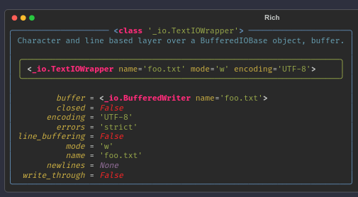

+++
title = "Using Rich Inspect to Interrogate Python Objects"
date = 2022-11-13T14:00:00-05:00
tags = ['til', 'python', 'rich', 'inspect']
authors = ['Christopher Tyler', 'Will McGugan']
summary = "Using Rich can help format an object in the REPL."
draft = false
+++

[Will McGugan's article](https://textual.textualize.io/blog/2023/07/27/using-rich-inspect-to-interrogate-python-objects)
goes through another way Rich can help with formatting.
The rest of the article are my notes.

If you invoke it with any object `inspect` will display a nicely formatted
report on that object -- which makes it great for interrogating objects from
the REPL.

```python
>>> from rich import inspect
>>> text_file = open("foo.txt", "w")
>>> inspect(text_file)
```



By default, `inspect` will generate a data-oriented summary with a text
representation of the object and its data attributes.
You can also add `methods=True` to show all the methods in the public API.
Also if you want to see the full unabbreviated help you can add `help=True`.

Finally there are few more arguments to refine the level of detail you need.
You can see the full range of options with this delightful little incantation:

```python
>>> inspect(inspect)
```

