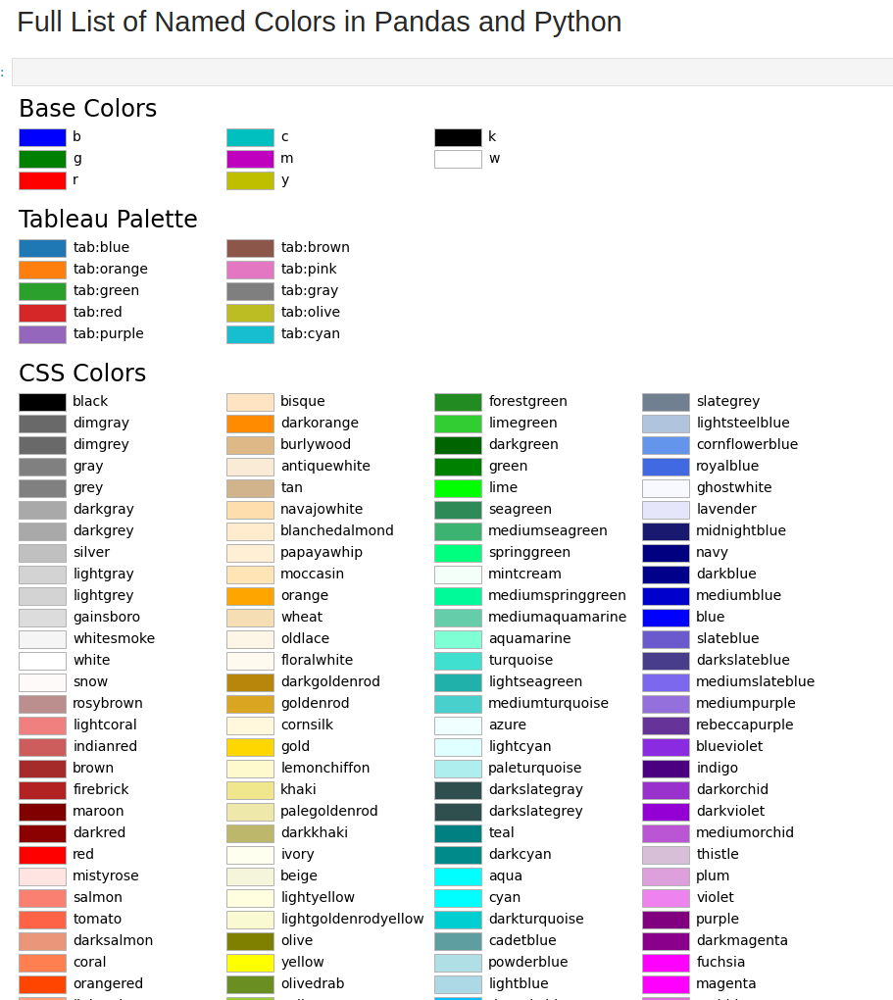

+++
title = 'List of Named Color for Pandas'
date = 2025-03-29T21:22:08-05:00
draft = false
tags = ['python','pandas']
summary = 'How to get a list of colors.'
comments = true
+++

## Overview

Found this at
https://datascientyst.com/full-list-named-colors-pandas-python-matplotlib/



## Getting Colors using Python

Below is code to use to get colors. 

```python
import matplotlib.colors as mcolors
import pandas as pd

def format_color_groups(df, color):
x = df.copy()
i = 0


for factor in color:
    x.iloc[i, :-1] = ''
    style = f'background-color: {color[i]}'
    x.loc[i, 'display color as background'] = style
    i = i + 1


return x

colors = {
        'name': mcolors.BASE_COLORS.keys(),
        'rgb': mcolors.BASE_COLORS.values()
      }

df_colors = pd.DataFrame(colors)
df_colors['hex'] = df_colors['rgb'].apply(mcolors.rgb2hex)

df_colors['display color as background'] = ''
df_colors.style.apply(format_color_groups, color=df_colors.hex, axis=None)
```

To get more colors do the following: 

```python
import matplotlib.colors as mcolors
import pandas as pd

def format_color_groups(df, color):
x = df.copy()
i = 0


for factor in color:
    x.iloc[i, :-1] = ''
    style = f'background-color: {color[i]}'
    x.loc[i, 'display color as background'] = style
    i = i + 1


return x

colors = {
        'name': mcolors.CSS4_COLORS.keys(),
        'rgb': mcolors.CSS$_COLORS.values()
      }

df_colors = pd.DataFrame(colors)
df_colors['rgb'] = df_colors['hex'].apply(mcolors.hex2color)
df_colors['rgb'] = df_colors['rgb'].apply(lambda x:[round(c, 5) for c in x])

df_colors['display color as background'] = ''
df_colors.style.apply(format_color_groups, color=df_colors.hex, axis=None)
```

## Summary

You can also go to
https://matplotlib.org/stable/gallery/color/named_colors.html as well.
